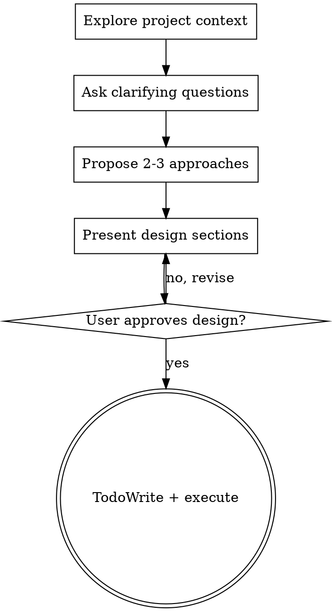

# Quick Build

A lightweight version of brainstorming for small features and quick changes. Retains the core design-thinking flow but skips formal documentation and planning steps, going straight to TodoWrite and execution after design approval.

## When to Use

- Small feature additions (new button, config flag, minor UI change)
- Quick bug fixes that need design consideration
- Single-file or few-file changes
- Changes where the scope is clear after a brief discussion

## When NOT to Use

- Multi-subsystem features (use brainstorming instead)
- Changes requiring formal documentation for compliance
- Architectural decisions that affect multiple teams
- Changes that need stakeholder review

<HARD-GATE>
Do NOT write any code or take implementation action until you have presented a design and the user has approved it. Even for "simple" changes, you MUST go through this process.
</HARD-GATE>

## Anti-Pattern: "This Is Too Simple To Need Design"

Small changes are where unexamined assumptions cause the most wasted work. The design can be a few sentences, but you MUST present it and get approval.

## Checklist

You MUST create a task for each of these items and complete them in order:

1. **Explore project context** — check relevant files, recent changes
2. **Ask clarifying questions** — one at a time, understand purpose/constraints/success criteria
3. **Propose 2-3 approaches** — with trade-offs and your recommendation
4. **Present design** — in sections scaled to their complexity, get user approval after each section
5. **User confirms design** — quick verbal confirmation, no formal doc needed
6. **TodoWrite + execute** — create task list and begin implementation

## Process Flow

**The terminal state is executing via TodoWrite.** Do NOT invoke writing-plans or any other skill after design approval.

## The Process

**Understanding the idea:**

- Check out the current project state first (files, docs, recent commits)
- Before asking detailed questions, assess scope: if the request describes multiple independent subsystems (e.g., "build a platform with chat, file storage, billing, and analytics"), flag this immediately. Don't spend questions refining details of a project that needs to be decomposed first.
- If the project is too large for a single spec, help the user decompose into sub-projects: what are the independent pieces, how do they relate, what order should they be built? Then brainstorm the first sub-project through the normal design flow. Each sub-project gets its own spec → plan → implementation cycle.
- For appropriately-scoped projects, ask questions one at a time to refine the idea
- Prefer multiple choice questions when possible, but open-ended is fine too
- Only one question per message - if a topic needs more exploration, break it into multiple questions
- Focus on understanding: purpose, constraints, success criteria

**Exploring approaches:**

- Propose 2-3 different approaches with trade-offs
- Present options conversationally with your recommendation and reasoning
- Lead with your recommended option and explain why

**Presenting the design:**

- Once you believe you understand what you're building, present the design
- Scale each section to its complexity: a few sentences if straightforward, up to 200-300 words if nuanced
- Ask after each section whether it looks right so far
- Cover: architecture, components, data flow, error handling, testing
- Be ready to go back and clarify if something doesn't make sense

**Design for isolation and clarity:**

- Break the system into smaller units that each have one clear purpose, communicate through well-defined interfaces, and can be understood and tested independently
- For each unit, you should be able to answer: what does it do, how do you use it, and what does it depend on?
- Can someone understand what a unit does without reading its internals? Can you change the internals without breaking consumers? If not, the boundaries need work.
- Smaller, well-bounded units are also easier for you to work with - you reason better about code you can hold in context at once, and your edits are more reliable when files are focused. When a file grows large, that's often a signal that it's doing too much.

**Working in existing codebases:**

- Explore the current structure before proposing changes. Follow existing patterns.
- Where existing code has problems that affect the work (e.g., a file that's grown too large, unclear boundaries, tangled responsibilities), include targeted improvements as part of the design - the way a good developer improves code they're working in.
- Don't propose unrelated refactoring. Stay focused on what serves the current goal.

## After Design Approval

Once the user approves the design:

1. Use TodoWrite to create a task for each implementation step
2. Begin executing tasks in order
3. Do NOT invoke writing-plans, brainstorming, or any other skill — go straight to implementation

## Key Principles

- **One question at a time** - Don't overwhelm with multiple questions
- **Multiple choice preferred** - Easier to answer when possible
- **YAGNI ruthlessly** - Remove unnecessary features
- **Explore alternatives** - Always propose 2-3 approaches
- **Incremental validation** - Present design, get approval before coding
- **No formal docs** - Skip spec writing, rely on verbal confirmation
- **Go straight to TodoWrite** - No writing-plans step
